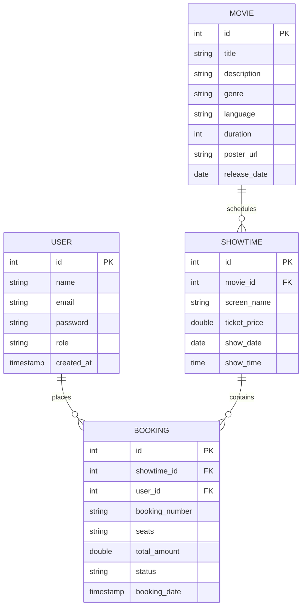

# 🎬 CineLuv — Premium Cinema Booking Experience

CineLuv is a state-of-the-art, premium full-stack Single Page Application (SPA) designed to deliver an immersive, premium movie booking experience. The application features a stunning glassmorphism design, interactive seating grids, live currency calculations, and dual-role workflows for customers and cinema administrators. 

Initially developed as a dollar-based western movie app, the codebase has been fully localized to showcase **Telugu Cinema** with localized pricing in **Indian Rupees (₹200–₹300)**.

---

## 🚀 Key Features

### 1. **Visual Excellence & High-Fidelity SPA**
- Fully responsive design using modern CSS3 grid layouts, curated dark-mode HSL color palettes, and glassmorphic aesthetic glows.
- Smooth transition animations between views without full-page reloads, maintaining consistent client-side application state.
- Dynamic Spotlight Hero Banner that changes based on premium film promotions.

### 2. **Interactive Theater Seating Map & Price Engine**
- Responsive theater seating grid mapping **Rows A–F and Columns 1–10** (60 individual seat nodes).
- Real-time client-side subtotal price calculations.
- Live seating state updates, locking booked seats (`occupied`) and dynamically rendering selections.
- Ticket stub receipt generator detailing unique reservation references, screens, dates, and names.

### 3. **Dual-Role User Workflows**
- **Customer Workspace:** Browse seeded movies, inspect showtimes, book seats, print receipt stubs, and audit booking logs in the custom **My Tickets** dashboard.
- **Admin Management Portal:** Review aggregated business metrics:
  - Total Movie Listings
  - Active Publish Showtimes
  - Real-Time System Revenue (aggregated dynamically from confirmed transactions in Indian Rupees)
  - Interactive forms to publish new films and schedule showtimes.
  - Live Booking Ledger Audit feeding transaction details, timestamps, and customer IDs.

### 4. **Adaptive Backend & DB Seeding Engine**
- Built on Spring Boot 3 / Java 25 with automatic database bootstrapping.
- Pre-seeded high-quality catalog containing popular films (*Hi Nanna*, *Most Eligible Bachelor*, *Godavari*, *Anand*) integrated with Wikipedia media assets.

---

## 🛠️ Technology Stack

| Tier | Technology | Description |
|---|---|---|
| **Backend Framework** | Spring Boot 3.x | RESTful API controllers, transactional services |
| **Language** | Java 25 | Modern language features, stream operations |
| **ORM / Persistence** | Hibernate / Spring Data JPA | Relational database mapping & automated schemas |
| **Database** | MySQL 9.6 | Production-grade transactional data persistence |
| **Frontend Architecture** | Single Page Application (SPA) | Pure Vanilla JavaScript ES6+ State Controller |
| **Styling & UI** | Vanilla CSS3 / HTML5 | Glassmorphism design tokens, Outfit & Inter fonts, FontAwesome icons |

---

## 🗄️ Database Architecture

The application models relationships across four key entities in a localized MySQL database:



---

## ⚙️ Quick Start & Installation

### 1. Prerequisites
Ensure you have the following installed on your machine:
- **Java JDK 21 or 25**
- **Maven 3.8+** (or use the included wrapper `./mvnw`)
- **MySQL Server** running locally on port 3306

### 2. Database Setup
Create the target MySQL schema inside your MySQL shell:
```sql
CREATE DATABASE cinema_booking_db;
```

Update your local credentials inside `src/main/resources/application.properties`:
```properties
spring.datasource.url=jdbc:mysql://localhost:3306/cinema_booking_db?createDatabaseIfNotExist=true&useSSL=false&allowPublicKeyRetrieval=true&serverTimezone=UTC
spring.datasource.username=root
spring.datasource.password=YOUR_MYSQL_PASSWORD
```

### 3. Build and Run
Boot up the Spring Boot application by running the Maven command from the project root:
```bash
./mvnw spring-boot:run
```
Upon startup, the custom `DataSeeder` automatically initializes tables, registers administrative accounts, and publishes Telugu films and showtime schedules.

---

## 🔑 Pre-Seeded Accounts for Immediate Testing

You can use the following default accounts to explore the CineLuv workspaces:

### **Standard Customer Account**
- **Email:** `user@cinema.com`
- **Password:** `password`
- **Actions:** Browse movies, book seats, view tickets history.

### **System Administrator Account**
- **Email:** `admin@cinema.com`
- **Password:** `admin`
- **Actions:** Add movies/showtimes, view booking ledger, track system revenue.

---

## 📜 License
This project is open-source and available under the **MIT License**. Crafted for elite, modern cinema booking experiences.

#Demo Video


https://github.com/user-attachments/assets/b1b81bea-8fdd-46dc-97ff-b80aa51e89c0


